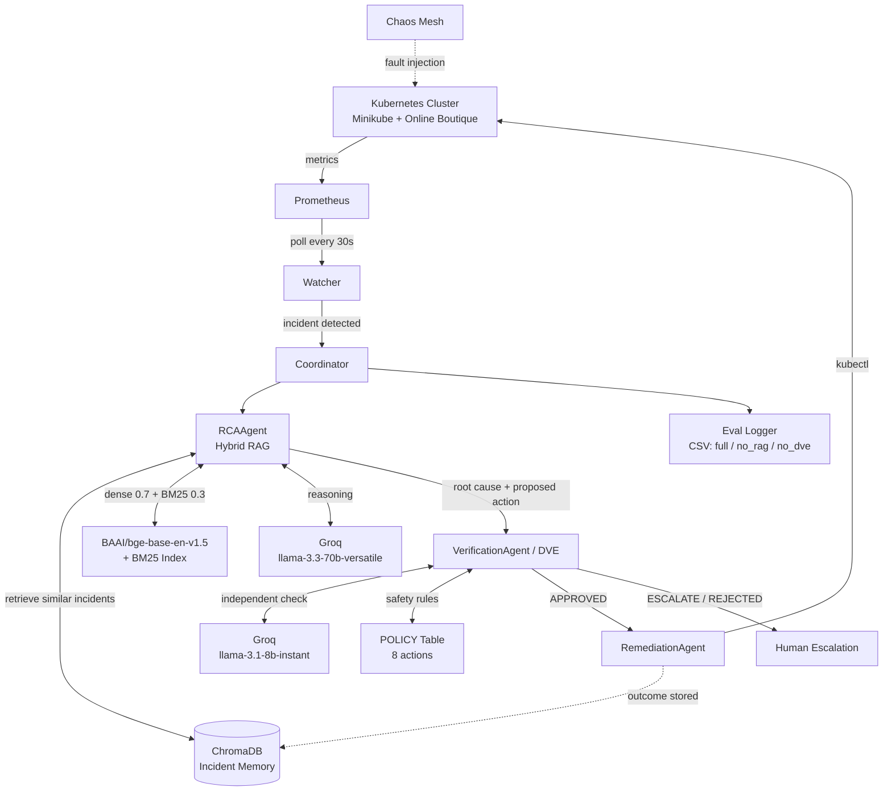

# NOVA — Multi-Agent Autonomous Kubernetes Incident Response

> An autonomous, multi-agent system that detects Kubernetes incidents from live Prometheus metrics, diagnoses root causes using hybrid Retrieval-Augmented Generation (RAG), independently verifies the proposed fix against a safety policy, and executes remediation via `kubectl`.


---

## Table of Contents

- [Overview](#overview)
- [Key Features](#key-features)
- [System Architecture](#system-architecture)
- [Agent Breakdown](#agent-breakdown)
- [Tech Stack](#tech-stack)
- [Research Hypotheses & Evaluation](#research-hypotheses--evaluation)
- [Project Structure](#project-structure)
- [Getting Started](#getting-started)
- [Configuration](#configuration)
- [Running NOVA](#running-nova)
- [Chaos Testing](#chaos-testing)
- [Roadmap](#roadmap)
- [Author](#author)

---

## Overview

Kubernetes incidents such as `CrashLoopBackOff`, OOM kills and pod failures are typically triaged by on-call engineers who must correlate metrics, logs and past incidents before acting. This is slow, error-prone and hard to scale.

**NOVA** automates this loop end to end. A watcher continuously polls Prometheus, and when an anomaly is detected a pipeline of specialised agents performs root cause analysis (RCA), **verifies the proposed remediation for safety before anything is executed**, and then applies the fix to the cluster.

NOVA is developed as an Integrated M.Tech (CSE) capstone project at **VIT-AP University** and is the basis of an IEEE research paper.

## Key Features

- **Fully automated detection** — Prometheus-polling watcher triggers the pipeline every 30 seconds, no manual input.
- **Hybrid RAG for RCA** — dense semantic retrieval (ChromaDB + BGE embeddings) combined with sparse keyword retrieval (BM25) over a corpus of past incidents.
- **Floor + ceiling retrieval** — retrieves top-6 candidates with a 35% minimum score threshold instead of a fixed top-k.
- **Decision Verification Engine (DVE)** — an independent LLM plus a rule-based POLICY table gates every action before execution, reducing unsafe auto-remediation.
- **Autonomous remediation** — executes verified actions through `kubectl` against live pods.
- **Built-in ablation logging** — evaluation logger records three conditions (`full`, `no_rag`, `no_dve`) to CSV for reproducible experiments.
- **Chaos-tested** — validated with Chaos Mesh fault injection on the Online Boutique microservices demo.

## System Architecture



<details>
<summary>Text version of the pipeline</summary>

```
Prometheus ──▶ Watcher (30s) ──▶ Coordinator ──▶ RCAAgent (Hybrid RAG)
                                                      │
                                                      ▼
                                         VerificationAgent / DVE
                                          (LLM check + POLICY table)
                                                      │
                                   ┌──────────────────┴──────────────────┐
                              APPROVED                          ESCALATE / REJECTED
                                   │                                     │
                                   ▼                                     ▼
                          RemediationAgent                       Human escalation
                           (kubectl exec)
```
</details>

### Workflow

1. **Detect** — the Watcher polls Prometheus every 30 seconds and raises an incident when a monitored condition crosses its filter (e.g. `CrashLoopBackOff` at `CRITICAL` severity).
2. **Coordinate** — the Coordinator packages the live incident context and routes it through the agent pipeline.
3. **Diagnose** — the RCAAgent retrieves similar historical incidents via hybrid RAG and asks the LLM for a root cause and proposed remediation.
4. **Verify** — the VerificationAgent (DVE) scores the supporting evidence and checks the proposed action against the POLICY table, returning `APPROVED`, `ESCALATE` or `REJECTED`.
5. **Remediate** — approved actions are executed with `kubectl` on the live affected pod.
6. **Log & learn** — every incident and outcome is logged for evaluation and can be fed back into incident memory.

## Agent Breakdown

| Component | Responsibility | Model / Tech |
|---|---|---|
| **Watcher** | Polls Prometheus every 30s, filters by severity, triggers pipeline | Prometheus API |
| **Coordinator** | Orchestrates agents, passes incident context, handles cooldowns | Python |
| **RCAAgent** | Root cause analysis using hybrid RAG over past incidents | `llama-3.3-70b-versatile` (Groq) |
| **VerificationAgent (DVE)** | Independent safety verification of proposed actions | `llama-3.1-8b-instant` (Groq) + POLICY table |
| **RemediationAgent** | Executes approved actions against the cluster | `kubectl` |
| **Eval Logger** | Records outcomes under three ablation conditions | CSV |

### Hybrid Retrieval Details

- **Dense retrieval:** ChromaDB with `BAAI/bge-base-en-v1.5` embeddings — weight **0.7**
- **Sparse retrieval:** BM25 — weight **0.3**
- **Candidate selection:** top-6 candidates with a **35% minimum score** (floor + ceiling approach)

### Decision Verification Engine (DVE)

The DVE is deliberately **independent** of the RCAAgent — it uses a separate, smaller model and a static POLICY table covering 8 remediation actions, so that a hallucinated or over-confident diagnosis cannot directly trigger a destructive change. Each proposed action results in one of:

- `APPROVED` — executed automatically
- `ESCALATE` — requires human review
- `REJECTED` — blocked

## Tech Stack

| Layer | Technology |
|---|---|
| Language | Python |
| Orchestration | Kubernetes (Minikube) |
| Monitoring | Prometheus |
| Vector store | ChromaDB |
| Embeddings | BAAI/bge-base-en-v1.5 |
| Sparse retrieval | BM25 |
| LLM inference | Groq (llama-3.3-70b-versatile, llama-3.1-8b-instant) |
| Fault injection | Chaos Mesh |
| Target application | Google Online Boutique |

## Research Hypotheses & Evaluation

NOVA is evaluated through ablation across three conditions:

| Condition | Description |
|---|---|
| `full` | Complete pipeline (RAG + DVE + memory) |
| `no_rag` | RCA without retrieval |
| `no_dve` | Remediation without verification |

| Hypothesis | Statement |
|---|---|
| **H1** | Retrieval-augmented RCA improves root cause accuracy |
| **H2** | The DVE reduces unsafe automatic executions |
| **H3** | A memory-augmented architecture reduces Mean Time To Resolution (MTTR) |

Per-incident results are written to a CSV by the eval logger, from which H1/H2/H3 metrics are computed.

## Project Structure

> Adjust to match your actual repo layout.

```
nova-k8s-incident-management/
├── agents/
│   ├── coordinator.py
│   ├── rca_agent.py
│   ├── verification_agent.py
│   └── remediation_agent.py
├── watcher/
│   └── prometheus_watcher.py
├── rag/
│   ├── corpus/               # historical incident corpus
│   └── retriever.py          # ChromaDB + BM25 hybrid
├── policy/
│   └── policy_table.py       # DVE safety rules
├── eval/
│   └── eval_logger.py        # ablation logging (CSV)
├── chaos/                    # Chaos Mesh experiment manifests
├── .env.example
├── requirements.txt
└── README.md
```

## Getting Started

### Prerequisites

- Python 3.10+
- Docker
- [Minikube](https://minikube.sigs.k8s.io/) and `kubectl`
- Helm (for Prometheus and Chaos Mesh)
- A [Groq API key](https://console.groq.com/)

### Installation

```bash
# 1. Clone the repository
git clone https://github.com/KOUSHIK-SAI-TALLURI/nova-k8s-incident-management.git
cd nova-k8s-incident-management

# 2. Create a virtual environment
python -m venv venv
source venv/bin/activate        # Windows: venv\Scripts\activate

# 3. Install dependencies
pip install -r requirements.txt
```

### Cluster Setup

```bash
# Start a local cluster
minikube start

# Deploy the target application (Online Boutique)
kubectl apply -f <online-boutique-manifest>

# Install Prometheus and Chaos Mesh via Helm
helm install prometheus prometheus-community/prometheus
helm install chaos-mesh chaos-mesh/chaos-mesh -n chaos-mesh --create-namespace
```

## Configuration

Copy the example environment file and add your keys:

```bash
cp .env.example .env
```

```env
GROQ_API_KEY=your_groq_api_key_here
PROMETHEUS_URL=http://localhost:9090
```

> **Never commit your `.env` file.** Make sure it is listed in `.gitignore`.

## Running NOVA

```bash
# Expose Prometheus locally
kubectl port-forward svc/prometheus-server 9090:80

# Start the NOVA watcher and pipeline
python main.py
```

Once running, the watcher polls Prometheus every 30 seconds and the pipeline triggers automatically when an incident is detected.

## Chaos Testing

Faults are injected into Online Boutique using Chaos Mesh to generate real incidents (e.g. pod failures, crash loops, memory pressure):

```bash
kubectl apply -f chaos/<experiment>.yaml
```

NOVA should detect the failure, diagnose it, verify the fix and remediate — with every step recorded by the eval logger.

## Roadmap

- [x] Automated Prometheus watcher
- [x] Hybrid RAG RCA agent
- [x] Independent verification engine (DVE) with POLICY table
- [x] Automated `kubectl` remediation
- [x] Ablation eval logger (`full`, `no_rag`, `no_dve`)
- [ ] Recalibrate DVE evidence thresholds for floor + ceiling retrieval
- [ ] Ground-truth action mapping per incident
- [ ] Full ablation runs and H1/H2/H3 results
- [ ] IEEE paper submission

## Author

**Koushik Sai Talluri**
Integrated M.Tech CSE — VIT-AP University
GitHub: [@KOUSHIK-SAI-TALLURI](https://github.com/KOUSHIK-SAI-TALLURI)

---

*NOVA is a research prototype. Autonomous remediation should only be run against test clusters.*
